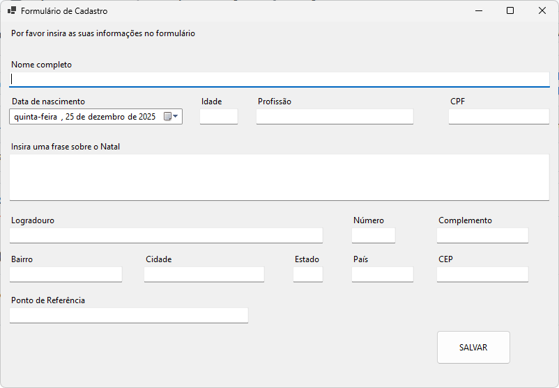

# formulario-crud-meu-novo-formulario
Projeto pessoal que iniciei no dia de Natal para estudos de C# com conexão a banco de dados SQL Server

Recursos utlizados:
- Windows Forms App C# .NET
- Banco SQL Server
- Gemini para apoio no passo a passo

Planejamento:
- Criar um CRUD completo, com validações em todos os campos;
- Subir o progresso do projeto para o GitHub via upload;
- Integrar a API de consulta de CEP para preencher o endereço;
- Gerar um arquivo .exe do projeto (Usando SQLite).

